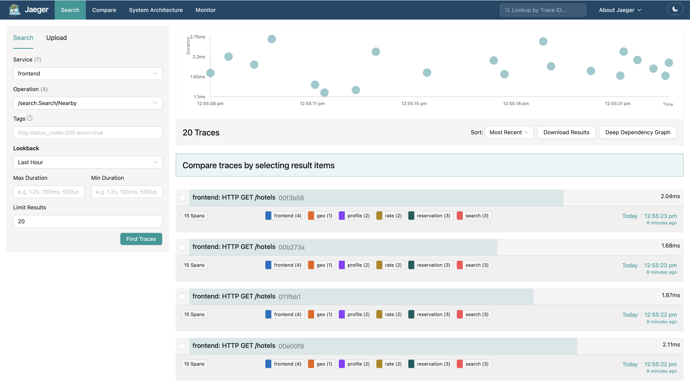
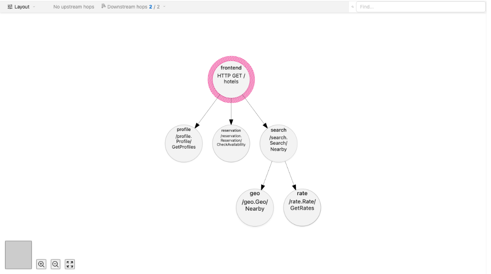

For a few weeks this spring, I thought my team had uncovered a way to make datacenters meaningfully more energy efficient. Spoiler: we hadn't. But trying (and failing) to reproduce our initial results taught me more about repeatable performance testing than the original finding ever would have.

Datacenters - the windowless buildings behind every online purchase, post, and prompt - are consuming electricity at alarming rates. Critics argue that datacenters as environmentally disruptive, and recent construction projects have been delayed in part due to these concerns. For our final project in **CS8803: Datacenter Networks and Systems**, we asked: could software make these facilities more energy efficient?

Our approach: clever _load balancing algorithms_ that distribute work amongst hundreds of servers. [Sinking a datacenter in the ocean](https://news.microsoft.com/source/features/sustainability/project-natick-underwater-datacenter/) or [launching one into space](https://www.npr.org/2026/04/03/nx-s1-5718416/ai-data-centers-in-space-spacex-elon-musk) was out of scope for the course, so software optimizations felt like a more practical approach.

My job was to simulate thousands of users concurrently searching for hotels online while taking detailed measurements of servers' _power consumption_ and _response latency_ (think: time it takes to receive a confirmation message after clicking "book" on AirBnB).

# How It All Started


The figure above shows two plots: latency on the left, power consumption on the right, as we increase the number of queries per second (QPS). In the latency plot, solid lines represent median latency while dashed lines represent p99 latency (i.e. the latency that 99% of requests come in under). In both plots, the blue and orange lines represent different _frequency governors_. These frequency governors act similar to a speed limiter in a car: they intentionally limit the CPU clock rate (or top speed) to optimize for power utilization (or fuel economy/safety).

In the power plot, we can see the `schedutil` governor (blue line) uses consistently less power than the `performance` governor (orange line). Meanwhile, the latency plot shows that `schedutil` matches `performance` in terms of latency as we increase the QPS. Because earlier experiments did not show a power gap at high load between the two governors, this result was surprising, but certainly not impossible.

If this held up, it would mean **real power savings** for some production workloads without any modifications to an application's code\*. The best part is we don't have to sacrifice _p99 latency_, a metric datacenter operators tend to care about most, because it captures the worst experience most users will have. Admittedly, I didn't recognize the impact of this discovery at the time - but our professor did!

\*A small caveat is that we need to be able to run servers close to maximum load, which is difficult since users tend overestimate how much resources they will need, leading to _underutilization_. The real challenge, however, would be reproducing these results on a larger cluster.

# Debugging My Experiments

As I set out to reproduce these results, a complicated experimental setup and a three-week deadline conspired to create one of the trickiest debugging challenges I've faced so far!

First, the setup - I used six intel-based machines (courtesy of Cloudlab) that have more cores than your typical PC and dedicated high-bandwidth links connecting them. Each experiment is conducted using a pair of machines, with a client machine acting as a load generator and a separate server hosting the hotel search service. Crucially, both client and server have identical specs and ample cores. This ensures that (1) clients can simulate high QPS traffic and (2) servers can serve this traffic in a reasonable amount of time before they become saturated.


Second, the tight deadlines encouraged me to run multiple experiments in parallel across pairs of machines - an effective technique that can have its pitfalls if not orchestrated carefully (read on to learn more!)

Before we investigate **four potential flaws** in my setup, it's important to understand which quantities I am measuring and how they are being measured. In my experiments,

Throughout my investigation, I share a few general tips for conducting reproducible benchmarks and building trust in your results. I believe the tips in this post are helpful not only to researchers, but for engineers in industry too! Just as researchers make claims in papers that must be backed by reproducible results, companies make guarantees about how their services will perform in the real world through _service-level objectives (SLOs)_.

Before diving into the investigation, it's important to understand the exact quantities I am measuring, how the experiments work at a high level, and what baselines for this kind of experiment look like.

, I decided to run multiple experiments in parallel across a cluster of machines

- para 2: elaborate on setup, emphasize why no docker and why that made things difficult (pinning processes to cores), tricky intel frequency governor behavior, etc.

- what the reader can expect next, (my steps which motivate useful tips, ), why they should care

The tips I've compiled in this guide are based on my experience running experiments against a gRPC-based hotel reservation service, part of the larger DeathStarBench cloud microservices benchmark. Feel free to fork this [repo](https://github.com/kworathur/DeathStarBench/) if you'd like to follow along in the code.

I am trying to measure the median and p99 latency of the hotel reservation application while increasing the number of requests per second (RPS). The experiment finishes once the server has reached a point of _saturation_, which is the point at which all of its CPU resources are fully utilized.

## Pinning Down Noisy Results

- Some procs might run on the same core

- show taskset pgrep

## Catching the Warm Cache

## Measuring the Wrong Window

-

## Reconciling the Servers

- tip: git bisect

- show change that introduced a filter in the reservation cache. Show raw logs that demonstrate that power utilization is consistently 4W higher for the unfiltered cache query

## 1. Establishing Baselines

As we add more variables to our experiments, baselines come in handy, giving us a way to sanity check our results. Baselines should be obtained from the exact same setup we plan to run real experiments against, as not every machine in a datacenter may have the same resources (which makes the datacenter environment _heterogeneous_). For example, machines may use CPUs from different vendors (AMD or Intel), have a different number of cores, or different bandwidth on their network interface cards (NICs). For my experiments, I am using two identical machines with the specs below (more on why this is important soon):

In general, a baseline can be a simplified version of the algorithm you are experimenting with, or an algorithm that has a well-maintained open source implementation. Since I'm comparing algorithms that limit a CPU's clock rate, a natural baseline is an algorithm that that lets the CPU use its maximum clock rate without any imposed limits. This algorithm is referred to as the `performance` governor in this post. To obtain my baseline measurements, I cloned the DeathStarBench repo and followed the instructions in the `README.md` for deploying the app inside docker containers.

After deploying the app, I had access to an HTTP server that I could send requests to, which would then make remote procedure calls to relevant microservices and return search results to the client. To send thousands of these requests per second, I am using the [`wrk2` HTTP load testing tool](https://github.com/giltene/wrk2). For those following along, execute the `./scripts/install.sh` script in `hotelReservation` to install `wrk2`.

This is where the specs of the machines you use for testing can make or break your results: if the client has much fewer compute resources than the server (e.g. fewer threads), then it might not have the capacity to push the server to its true limits. As a result, the latency measures we obtain could be unreasonably high (e.g. on the order of seconds)

To start, I simulated 128 users collectively making 1,000 requests/second using `wrk2`:

```bash
../wrk2/wrk -D exp -t 4 -c 128 -d 50 -L -s ./wrk2/scripts/hotel-reservation/single-endpoint.lua 10.10.1.2 -R 1000 > schedutil_10000_hotels.txt
```

A minute later, I got back some useful latency measurements:

```
Test Results @ http://10.10.1.2:5000
  Thread Stats   Avg      Stdev     99%   +/- Stdev
    Latency     7.08ms    5.47ms  21.73ms   79.14%
    Req/Sec   254.77     95.55   500.00     67.37%
  Latency Distribution (HdrHistogram - Recorded Latency)
 50.000%    6.79ms <- median latency
 75.000%   10.83ms
 90.000%   14.59ms
 99.000%   21.73ms <- p99 latency
 99.900%   29.41ms
 99.990%   38.40ms
 99.999%   42.08ms
100.000%   42.91ms
```

There's our p99 latency in the fifth row from the bottom! It looks like 99% percent of requests completed in under ~22 milliseconds. These results are already super helpful because they give us an upper limit on the latency figures we should get. Anything much larger than these numbers can suggest that something might be wrong with our experimental setup.

## 2. Measuring a Single Path in Code

With our baseline established, we can get into the _real experiments_. There is just one catch: our hotel reservation application consists of multiple microservices that exchange messages to perform a search query. At companies like Netflix, applications consist of 700+ microservices, which can make troubleshooting anomalous results difficult.

To illustrate my point clearly, we can use an observability tool called [Jaeger](https://www.jaegertracing.io/) to visualize the code paths that are exercised for a search request. Jaeger allows us to trace the path a request takes through code in a way that print statements can't; using Jaeger, we can trace applications where a request may be passed through multiple containers (as is the case here) or multiple virtual machines scattered across a datacenter.

First, let's open the Jaeger dashboard in our browser (for those following along, run `./scripts/start_services.sh` and navigate to `http://localhost:5051`)



We can see that search requests complete within 2 milliseconds on average. See those colored squares under each trace? They represent the different microservices (geo, profile, rate, reservation) that our search requests depend on.

Next, let's click on one of the traces to get a better understanding of how a request passes through the code.



The visualization above is called a _dependency graph_, where circles represent microservices and arrows capture data dependencies. From this graph, we get a sense that searching for a hotel is not as straightforward as previously thought; when a user wishes to search for a hotel, our application actually has to call three seperate microservices to determine hotels that are:

1. Close by to the user's location
2. Within the user's price range
3. Available to book during the user's vacation

What you also don't see here is that each of the leaf microservices (i.e. the circles without arrows going out) are typically fetching data from a database (e.g. MongoDB) or a cache (e.g. Memcache). That's already a lot of moving pieces for a relatively straightforward search query! Now let's take a look at the code to make it simpler to debug odd results:

```go
func (s *Server) searchHandler(w http.ResponseWriter, r *http.Request) {

	log.Trace().Msg("starts searchHandler querying downstream")

	searchResp, err := s.searchClient.Nearby(ctx, &search.NearbyRequest{
		Lat:     lat,
		Lon:     lon,
		InDate:  inDate,
		OutDate: outDate,
	})


	reservationResp, err := s.reservationClient.CheckAvailability(ctx, &reservation.Request{
		CustomerName: "",
		HotelId:      searchResp.HotelIds,
		InDate:       inDate,
		OutDate:      outDate,
		RoomNumber:   1,
	})


	profileResp, err := s.profileClient.GetProfiles(ctx, &profile.Request{
		HotelIds: reservationResp.HotelId,
		Locale:   locale,
	})

	json.NewEncoder(w).Encode(geoJSONResponse(profileResp.Hotels))
}
```

In the `searchHandler` function, we can see three calls to the `rate`, `reservation` and `profile` microservices. For my debugging experiments, I temporarily removed the calls to `reservation` and `profile` , modifying the search handler to only return hotel pricing data.

This modification did not seem to help however, as I could still see variance in the latency metrics between consecutive experiments. That's when I decided to go a step further and remove caching entirely from the critical path of a search request.

Making this simplification of the codebase is what revealed the flaw in my experimental setup: I was not restarting the `memcache` server in between trials, which gave the `schedutil` governor an unfair advantage because its cache had been warmed by prior `performance` trials.

For those unfamiliar with caches, they essentially "remember" data that an application tends to access frequently to make data accesses faster. While this sounds great, a somewhat annoying side-effect of caches for reproducibility is that they start "cold" and grdually get "warmer" over time as an application's data access patterns stabilize.

That's one part of the puzzle solved: `schedutil` matches `performance` in latency measurements despite using less power because it had a warmer cache. The second part of the puzzle is figuring out why `schedutil` uses less power than `powerstat` even at high load. Read on to find out!

## 3. Documenting Configs

When your config lives in terminal commands that hide in long slack threads, it becomes _much_ harder to track the experiments you run. You might remember how our physics teachers in high school would be so picky about our lab notetaking:

Closer to the end of the project, I saved all of my experiment parameters in a python file and tracked changes to version control:

```python
#!/usr/bin/env python3
import os
from pathlib import Path


# Default workload assignment and governor order.
DEFAULT_TARGETS = ["hotels", "recommendations", "reservation", "user"]
DEFAULT_GOVERNORS = ["performance", "schedutil"]

# SSH configuration for connecting to experiment nodes.
SSH_USER = os.environ.get("HOTEL_REMOTE_SSH_USER", "")
SSH_KEY_PATH = os.path.expanduser(os.environ.get("HOTEL_REMOTE_SSH_KEY", ""))

# Repository and artifact layout on the remote hosts.
REPO_ROOT = Path(__file__).resolve().parents[2]
REMOTE_REPO_ROOT = os.environ.get("HOTEL_REMOTE_REPO_ROOT", str(REPO_ROOT))
REMOTE_SCRIPT = "hotelReservation/scripts/run_power_sweep.sh"

# Experiment defaults.
HOST_URL = os.environ.get("HOTEL_REMOTE_HOST_URL_TEMPLATE", "http://%h:5000")
THREADS = 4
CONNECTIONS = 128
RATES_SPEC = "1000:20000:1000"
WRK2_DURATION=30
POWERSTAT_INTERVAL = 0.5
POWERSTAT_SOURCE = "auto"
SETTLE_SECONDS = 5

# Result locations.
RESULTS_ROOT = REPO_ROOT / "results" / "distributed_power_sweeps"
LOCAL_OUTPUT_DIR = str(RESULTS_ROOT)
REMOTE_OUTPUT_BASE = os.environ.get("HOTEL_REMOTE_OUTPUT_BASE", "")
```

Tracking changes to my configuration helped me go back in the revision history and discover a timing bug in my experiment. In the file above, you can see that the duration of my load test (in `WRK2_DURATION`) is set to 30 seconds. However, the `powerstat` tool I'm using can only capture measurements over 60-second intervals at minimum, which is not immediately clear from the config.

This discrepancy is what leads to `powerstat` collecting some power measurements while the server is idle, and because the delay in collecting measurements was not uniform across all trials, there were times where `schedutil` had more idle measurements than `performance`, giving the illusion of `schedutil` using less power on average than `performance`.

Version control is your friend! I found myself branching off versions of code to get back to states of the codebase .

## Conclusion

By establishing baselines, starting small, and documenting my experiments, I was able to pinpoint the flaws in my setup, and fix my scripts to obtain results that myself and my colleagues could reproduce. (see below):


