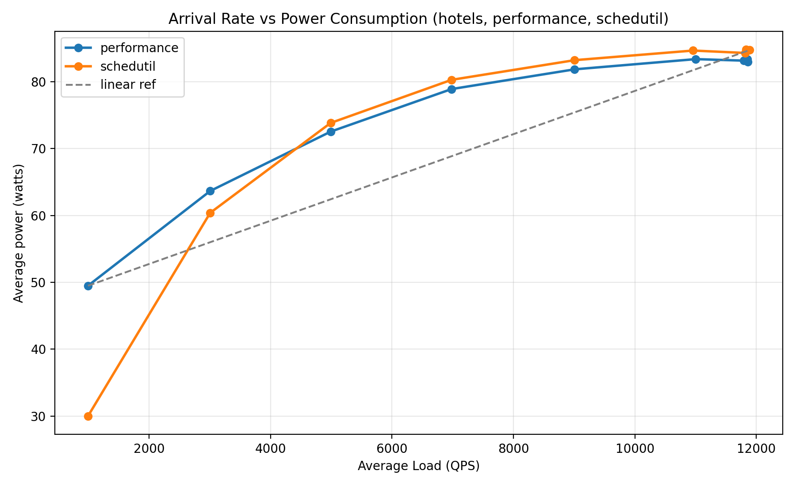
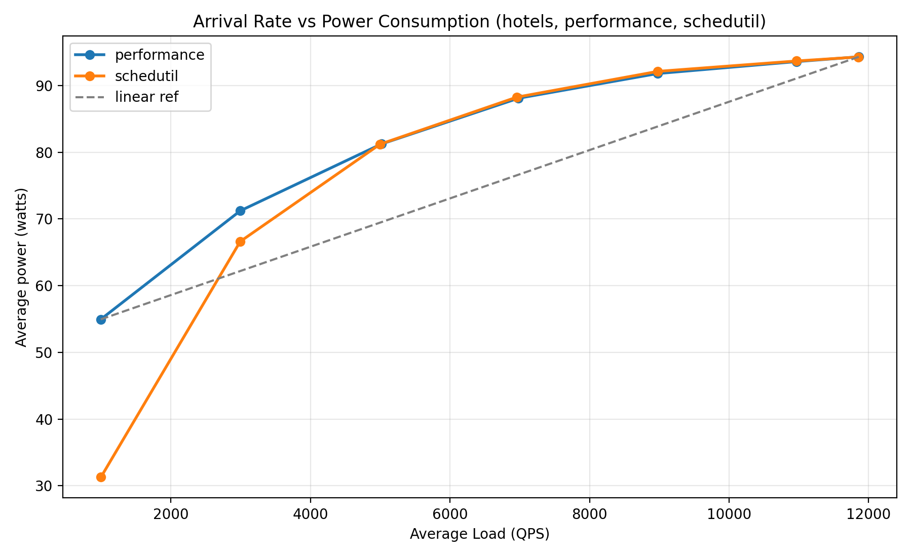
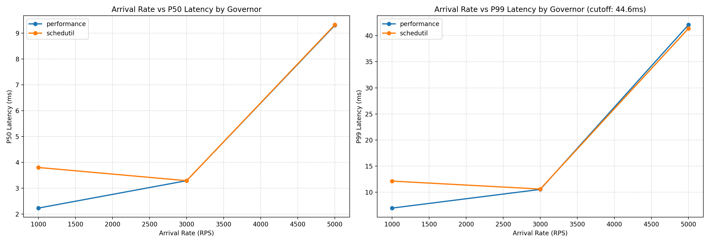
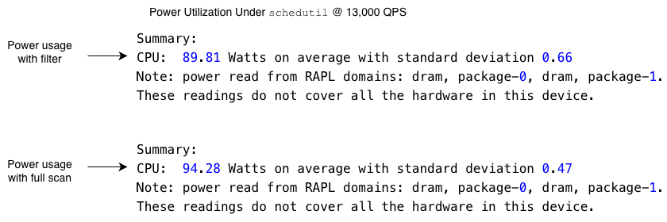
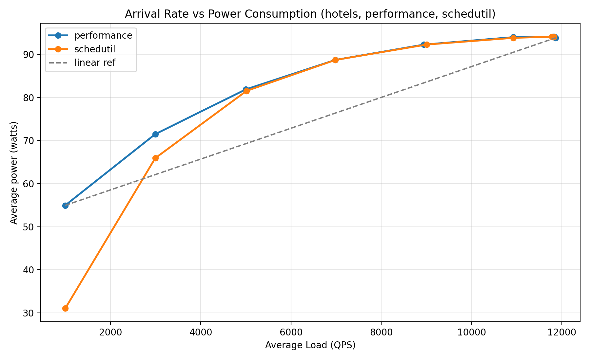
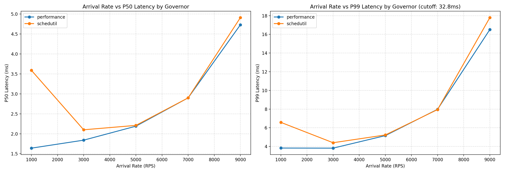

For a few weeks this spring, I thought my team had uncovered a way to make datacenters more energy efficient. Spoiler: we hadn't. But trying (and failing) to reproduce our initial results taught me more about repeatable performance testing than the original finding ever would have.

Datacenters - the windowless buildings behind every online purchase, post, and prompt - are consuming electricity at alarming rates. Critics argue that datacenters are environmentally disruptive, and recent construction projects have been delayed in part due to these concerns. For our final project in **CS8803: Datacenter Networks and Systems**, we asked: could software make these facilities more energy efficient?

Our approach: clever _load balancing algorithms_ that distribute work amongst hundreds of servers. [Sinking a datacenter in the ocean](https://news.microsoft.com/source/features/sustainability/project-natick-underwater-datacenter/) or [launching one into space](https://www.npr.org/2026/04/03/nx-s1-5718416/ai-data-centers-in-space-spacex-elon-musk) was out of scope for the course, so software optimizations felt like a more practical approach.

My job was to simulate thousands of users concurrently searching for hotels online while taking detailed measurements of servers' _power consumption_ and _response latency_ (think: time it takes to receive a confirmation message after clicking "book" on AirBnB).

# How It All Started


The figure above shows two plots: latency on the left, power consumption on the right, as we increase the number of queries per second (QPS). In the latency plot, solid lines represent median latency while dashed lines represent p99 latency (i.e. the latency that 99% of requests come in under). In both plots, the blue and orange lines represent different _frequency governors_. These frequency governors act similar to a speed limiter in a car: they intentionally limit the CPU clock rate (or top speed) to optimize for power utilization (or fuel economy/safety).

In the power plot, we can see the `schedutil` governor (blue line) uses consistently less power than the `performance` governor (orange line). Meanwhile, the latency plot shows that `schedutil` matches `performance` in terms of latency as we increase the QPS. `schedutil` dynamically adjusts clock rate based on demand; `performance` pins it at maximum. This made this result feasible, but nonetheless surprising, since earlier experiments hadn't shown such a clear power gap between the two. At high load you'd expect schedutil's dynamic adjustment to push the clock rate near maximum anyway, which should close the gap — but it didn't.

If this held up, it would mean **real power savings** for some production workloads without any modifications to an application's code. The best part is we don't have to sacrifice _p99 latency_, a metric datacenter operators tend to care about most, because it captures the worst experience most users will have. Admittedly, I didn't recognize the impact of this discovery at the time - but our professor did!

# Debugging My Experiments

As I set out to reproduce these results, I faced one of the trickiest debugging challenges so far, spurred on by a complicated experimental setup and a three-week deadline.

First, the setup - I used six intel-based machines (courtesy of Cloudlab) that have more cores than your typical PC and dedicated high-bandwidth links connecting them. Each experiment is conducted using a pair of machines, with a client machine acting as a load generator and a separate server hosting the hotel search service. Crucially, both client and server have identical specs and ample cores. This ensures that (1) clients can simulate high QPS traffic and (2) servers can serve this traffic in a reasonable amount of time before reaching their limits.


Second, the tight deadlines encouraged me to run multiple experiments in parallel across pairs of machines - a best practice that can nonetheless have its pitfalls if not orchestrated carefully.

Before I explain my debugging approach, it's important to understand which quantities I am measuring and how they are being measured. I ran my experiments on the hotel search service of the open-source [DeathStarBench](https://github.com/kworathur/DeathStarBench/) benchmarking suite, measuring three key quantities:

- _p50 latency_ (i.e. median latency), which is the time 50% of requests complete under.

- _p99 latency_, which is the time 99% of requests complete under. Latency measurements are reported in milliseconds and are obtained from a load testing tool called `wrk`, running on the client.

- _power consumption_ of the server that handles search requests, measured in watts and collected by the `powerstat` command-line utility running on the server. `powerstat` uses hardware interfaces on Intel machines to obtain accurate running average power measurements.

I'm measuring these quantities while incrementing the number of QPS until the server reaches its _saturation point_: the point at which a server cannot take on any more requests per unit time. Each trial tests a single QPS level, and I performed all trials for the `performance` governor before the `schedutil` governor.

We choose the `performance` governor as a baseline since it does _not_ limit the CPU's clock rate, and we want to see whether limiting clock rates can improve energy efficiency. Let's quickly run a test at low load (1000 QPS) to establish a baseline.

```text
Test Results @ http://10.10.1.2:5000
  Thread Stats   Avg      Stdev     99%   +/- Stdev
    Latency     7.08ms    5.47ms  21.73ms   79.14%
    Req/Sec   254.77     95.55   500.00     67.37%
  Latency Distribution (HdrHistogram - Recorded Latency)
 50.000%    6.79ms <- median latency
 75.000%   10.83ms
 90.000%   14.59ms
 99.000%   21.73ms <- p99 latency
 99.900%   29.41ms
 99.990%   38.40ms
 99.999%   42.08ms
100.000%   42.91ms
```

There's our p99 latency in the fifth row from the bottom! It looks like 99 percent of requests completed in under ~22 milliseconds. On the power side, `powerstat` reports the server using ~63W of power on average over a 60 second trial. These initial measurements will help us sanity check our fixes as we start debugging.

With that context and baseline in place, let's get into the investigation. We'll look at **three potential flaws** in my setup.
Along the way, I'll share some general tips for reproducible benchmarking, which can help not only researchers, but engineers in industry too! Just as researchers make claims in papers that must be backed by reproducible results, companies make guarantees about how their services will perform in the real world through _service-level objectives (SLOs)_.

## Pinning Down Noisy Results

Re-running my experiments without any changes, I found that power measurements varied between runs, with a standard deviation in power measurements of roughly **~2 watts**. This variability sometimes made it look like `schedutil` provided worse energy efficiency at high load than `performance`; in some runs, the opposite was true.



So which of these conclusions should we trust? Prior to starting my experiments, I wrote some custom scripts to deploy the search service without docker, in order to push the server with the highest QPS possible. I revisited the scripts I wrote earlier and noticed a subtle flaw: the placement of tasks on the server was left entirely up to the CPU.

The OS scheduler — the kernel component that decides which task runs on which core — is generally good at spreading tasks across a CPU's cores to minimize resource conflicts. Sometimes, however, they may schedule sub-optimally, placing two compute-bound tasks on the same core while others remain idle. I chose to **pin processes to run on separate cores**, preventing such collisions and making my experimental results more deterministic.

To do this, I used the `taskset` utility to set affinity of processes to cores. `taskset` lets you specify a list of cores a process should run on, which let me fix the application's cache to run on a core separate from all other processes. I did this specifically because the cache is a shared dependency of all requests, and giving it its own core to run on avoids spikes in power/latency measurements from the cache randomly being de-scheduled.

```bash
$ pgrep -f memcached | xargs -I{} taskset -cp {}
pid 223302's current affinity list: 0
```

Controlling for task placement helped me stabilize my power measurements in between runs. Now, I could notice a convergence in power usage between `schedutil` and `performance` governors at high load:



## Ruling Out the Cache

Remember how I said I ran all `performance` governor trials before `schedutil` trials? That seemingly benign detail might have biased the `schedutil` results in its favor due to shared cache state between trials. Caches provide faster accesses to frequently used application data than your standard database query. In the hotel search service, cache reads are included in the critical path to help the server maximize its response throughput.

To understand where caching fits into a search request, I used an observability tool called [Jaeger](https://www.jaegertracing.io/) to trace the path requests take through the system. Jaeger allows us to trace the path a request takes through code in a way that print statements can't; using Jaeger, we can trace requests that are passed through multiple containers, as is the case here:


We can see that when a user searches for a hotel, our application actually has to call three separate microservices to determine hotels that are (1) close by to the user's location (2) within the user's price range and (3) available to book during the user's vacation.

In particular, the reservation service queries reservations for a given hotel using an in-memory cache called `memcached`. To see if caching biased the experiment results, I first tried removing the cache reads from the reservation microservice and measuring the latency of requests. My reasoning was that if a warm cache had a tangible benefit to reducing latency for schedutil, then taking the cache out of the picture should take away this unfair advantage.



Without caching, the application became bottlenecked on MongoDB database reads, which caused p99 tail latency to explode at low load. Despite expecting `schedutil` to look worse without the cache advantage, the two governors stayed roughly matched in latency.

As a follow up, I decided to switch the order of my experiments - I would run `schedutil` trials first, then `performance` trials, effectively flipping the experiments in `performance`'s favor. After doing this, I still saw the same behavior - `schedutil` closely matching `performance` in latency at high loads. This convinced me that the latency figures from our initial tests were indeed accurate.

I turned my attention to the power measurements, the ones that showed a gap between `schedutil` and `performance`.

## Reconciling the Servers

After making my experiments reproducible, I started digging into my `git` commit history to find a version of the codebase that produced those peculiar power results at the start of this post. I had about **50 commits** that I made in the days prior to obtaining the initial results:

```bash
git log --oneline --pretty=fuller --all | grep 'Keshav' | wc -l
      50
```

Rather than check all of these commits one by one, I chose to use `git bisect`. This command performs a binary search over a commit history to find a breaking change that introduced a bug or broke a benchmark. When I ran `git bisect start`, I was prompted to give a reference to a known "bad" commit - a version of the codebase where I _couldn't_ reproduce my results. Next, I was prompted to give a known "good" commit - a version of the codebase where I _could_ reproduce my results:

The process of using `git bisect` to find the breaking change in my code looked something like this:

- I would let git bisect pick a commit roughly in the middle of the good–bad range
- I would compile the search service binaries, run my experiments, and spot-check the power results.
- I would mark the commit good or bad with `git bisect good` or `git bisect bad`, then let bisect pick the next candidate.

Finally, git was able to point me to the commit that broke my benchmark:

```text
first bad commit: c712651cda3c39bf4464ad46e076e0dce73cbc73
```

```diff
-		// memcached miss, set up mongo connection
		collection := s.MongoClient.Database("rate-db").Collection("inventory")
-		curr, err := collection.Find(context.TODO(), bson.D{})
+		filter := bson.D{
+			{"hotelId", id},
+			{"inDate", bson.D{{"$lte", req.InDate}}},
+			{"outDate", bson.D{{"$gte", req.OutDate}}},
+		}
+		curr, err := collection.Find(context.TODO(), filter)
		if err != nil {
-			log.Error().Msgf("Failed get rate data: ", err)
+			log.Error().Msgf("Failed to get rate data for hotel %s: %v", id, err)
				}
```

This change converted a full scan of the hotel rates database into a more precise query that filtered on the start and end date of the user's trip. Addressing this inefficiency in the application code resulted in power utilization that was roughly 4W lower than when the application did a full scan of the database, as the comparison below shows:



Based on this investigation, I could start to piece together what happened to produce a gap in power usage between `schedutil` and `performance`. Since I was using three pairs of machines to conduct my experiments, I committed and pushed this change on one server, but my orchestration scripts failed to propagate the change to the other two servers.

The result was **out-of-sync binaries** across the three servers, which made power usage appear higher on one server than the others, despite identical hardware specs and experimental parameters. Ensuring that binaries were built from the same application code confirmed my results from the previous two debugging experiments, showing that `schedutil` and `performance` governors converged in their power utilization at high load.

## Conclusion





In all three follow-up experiments, the bug was in my measurement, not in the system I was measuring. Once I controlled for task placement, caching, and binary mismatch, the original power savings from frequency-limiting **largely disappeared** (see power plot above). The latency story held up — both governors still converge at high load (see latency plot above). The 'big if true' result didn't survive contact with rigor, which makes for a less exciting conclusion but better science.
